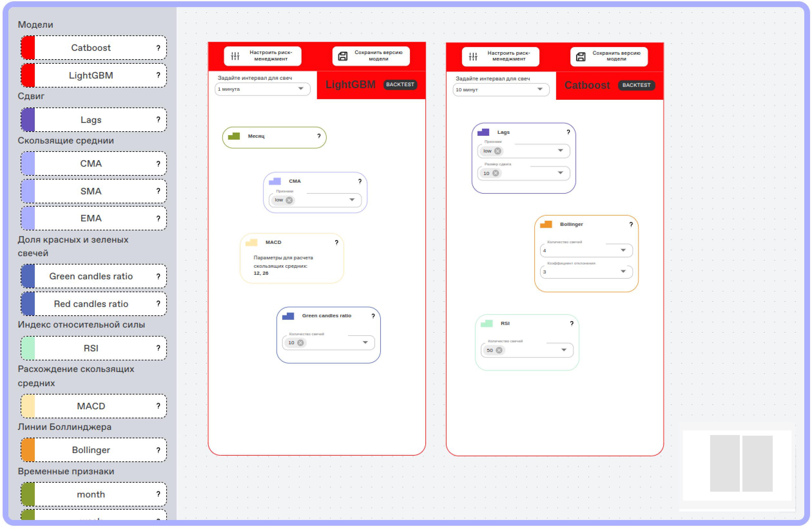
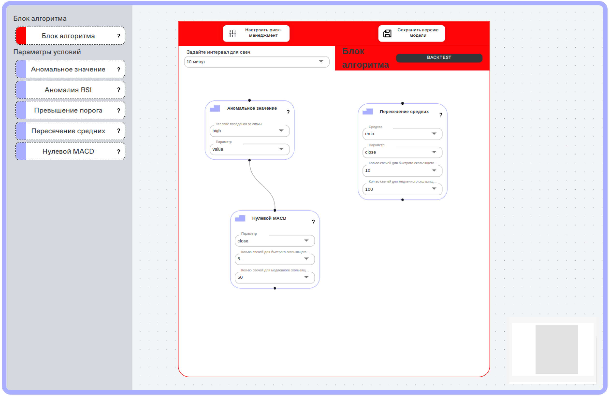

# MISIS Hilbert Space GO ALGO 📈🤖

## Описание решения
Мы разработали сервис с использованием ALGOPACK для алготрейдеров и инвесторов. 

*Для трейдеров*. Данный сервис позволяет создавать роботов для торговли на бирже как с помощью моделей машинного обучения, так и на основе различных сигналов. Простой и понятный интерфейс в виде блоков сильно упрощает процесс создания робота. После создания торгового алгоритма можно провести backtest на свежих данных торгов Московской Биржи и получить детальную информацию о доходности алгоритма. 

*Для инвесторов*. Имеется возможность выбрать понравившихся роботов, протестировать и приобрести их, тем самым без самостоятельного создания торгового алгоритма вложить свой капитал в алготрейдинг. 

Доступность и простота сервиса для людей, не знакомых с алготрейдингом, позволит сильно снизить порог входа в эту сферу.

## Решение

- Попробовать решение можно, перейдя по [ссылке](https://larek.itatmisis.ru)
  * Логин test@test.com
  * Пароль Test123456
- Ознакомиться с ML-ной частью решения, бэктестом и метриками можно, перейдя по [ссылке](https://drive.google.com/drive/folders/1Wfvfvy2mr8EGsSFTHDWb87Zifk3EZQo1) (model_backtest_metrics.ipynb)

## Репозитории
фронтенд - https://github.com/EgorTarasov/go-algo-frontend
мл - https://github.com/Kasuich/GoAlgoMlPart/

## Работа алгоритмов
- На выбор дается создание робота на основе ML модели (catboost, lightgbm) или с помощью блоков-сигналов.
- Пользователь может самостоятельно выбирать необходимые ему признаки для обучения своей ML модели.
- В алгоритмической секции имеется возможность создавать логические схемы с помщью блоков AND и IF.
- После создания робота имеется возможность сразу протестировать его доходность с помощью backtest.
- Backtest предоставляет детальную оценку работы робота и наглядные графики. 

### Интерфейс конструктора ML модели
 

### Интерфейс конструктора модели на блоках-сигналах

## Стек решения

- __Основная технология__: ALGOPACK
- __Бэкенд__: Python, Fastapi, Postgres
- __Фронтенд__: React, TypeScript
- __ML__: Python, CatBoost 🐈, LightGBM

## Команда

- Егор Тарасов, Backend Developer
- Мария Ульянова, ML Engineer
- Иван Плешаков, ML Engineer
- Надежда Анисимова, Frontend Developer
- Роман Шинкаренко, ML Engineer
